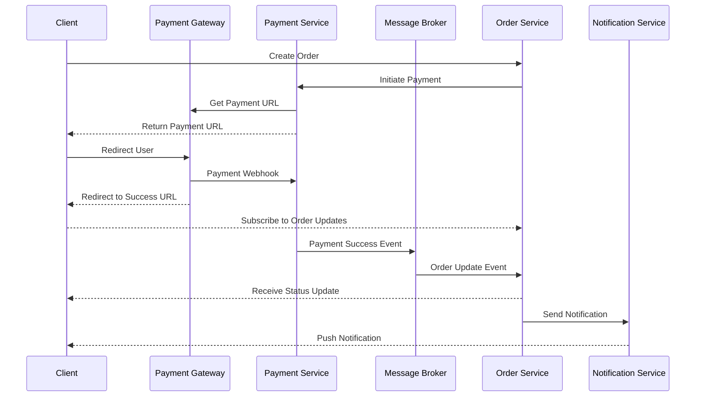

## Handling payments

Order service will communicate with payment service to intiate payment and the workflow will be as follows.

For simplicity, we'll skip the message broker in the initial implementation.